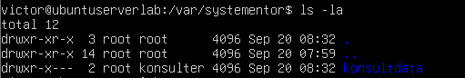
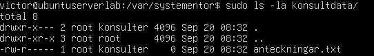
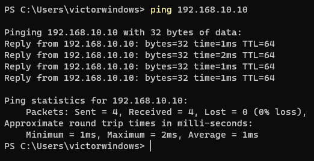
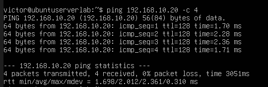

# Labbmiljö, CLI, Git & AI
## Victor Gunnarsson - ISCX26
### Introduktion

Denna labb är menat att visa praktiska färdigheter med att sätta upp och dokumentera en virtuell labbmiljö. Båda har 2 CPU-kärnor, 8GB ram samt tillräckligt stora hårddiskar så att operativsystemen kan installeras och köras ordentligt.

## Del 1: Skapa och och initiera projektet med Git

Först skapade jag en mapp på min lokala dator som innehåller filerna som ska vara i ett Git-repo. För att göra detta körde jag dessa kommandon för att sätta mappen som ett repo, och sedan för att koppla det till repot på min Github.

```
git init
git add Labbdokumentation_Victor_Gunnarsson.md
git commit -m "Första versionen av dokumentationen"
git branch -M main
git remote add origin git@github.com:Victor-Gunnarsson/Labbmiljo.git
git push -u origin main
```

## Del 2: Virtuell Labbmiljö & Nätverk

Maskinerna består av en Ubuntu Server och en klient som kör Windows 11. Båda virtualiserade i Virtualbox med nätverkskorten satta till Internal Network och statiska IP adresser så att de kan kommunicera med varandra.

Tabellöversikt för de två maskinerna med hostname, OS, IP- och subnätadress samt Interface-information:

| Information | Linux | Windows |
| ----------| -------- | ------- |
| Hostname | ubuntuserverlab | WINDOWS11LAB |
| Operativsystem | Ubuntu 26.04 LTS |Microsoft Windows 11 Home 10.0.26200 |
| IP address | 192.168.10.10 | 192.168.10.20 |
| Subnetmask | 255.255.255.0 | 255.255.255.0 |
| MAC-address | 08:00:27:6e:4d:94 | 08-00-27-EB-8B-5C |
| Interface | enp0s3 | Ethernet adapter Ethernet |

## Del 3: Kommandoraden & Felsökning

### Linux

1. Skapa mappen /var/systementor/konsultdata och filen anteckningar.txt via CLI.
    * `sudo mkdir -p /var/systementor/konsultdata` För att skapa mappen behöver kommandot `mkdir` med flagga -p köras, -p gör så att alla "parent"-mappar skapas, annars måste man köra mkdir för varje mapp  och filen skapas med `sudo touch anteckningar.txt`
2. Skapa en ny användargrupp (konsulter)
    * `sudo groupadd konsulter`
3. Tilldela mappen och filen till gruppen konsulter och ställ in behörigheter enligt principen om lägsta behörighet (Least Privilege, t.ex. chmod 750 på mappen och 640 på filen)
    * `sudo chown -R :konsulter /var/systementor/konsulter` Ändrar ägare till gruppen konsulter för både mappen /var/systementor/konsulter och alla filer i den mappen (-R för recursive)
    * `sudo chmod 750 /var/systementor/konsulter` Gör så att användarägaren root har full tillgång med att läsa, skriva samt köra (Read, Write, Execute), gruppägaren Konsulter kan läsa och köra (Read, Execute) och alla andra har ej tillgång.
    * `sudo chmod 640 /var/systementor/konsulter/anteckningar.txt` Sätter read och write rättigheter till användarägaren, read för gruppen och att övriga ej ska ha tillgång.
4. Inspektera och dokumentera behörigheterna via CLI (ls -la)
    * `ls -la` ger drwxr-x--- 2 root konsulter 4096 Sep 20 08:32 konsultdata
    * 
    * `ls -la konsultdata/`ger -rw-r----- 1 root konsulter 0 Sep 20 08:32 anteckningar.txt
    * 
5. Verifiera nätverksanslutningen till Windows-VM:en med ping samt visa nätverkskortets detaljer (ip addr show)
    * Se nedan efter Windows-sektionen för ping och nätverkskortsdetaljer


### Windows

1. Skapa mappen C:\Systementor\KonsultData via CLI.
    * `New-Item -ItemType Directory -Path C:\Systementor\KonsultData -Force` Skapar mappen KonsultData genom att specifiera hela vägen så att den skapar överliggande mappen Systementor också
2. Inspektera och dokumentera behörighetsstrukturen/ACL för mappen via PowerShell (Get-Acl)
    * `Get-ACL C:\Systementor\KonsultData` Hämtar och visar rättigheter för mappen. Ägare är Administrators och Administrators har full tillgång. Eftersom jag körde Terminalen som Administrator (Run as Administrator) får mappen rättigheter från Administrators.
    * 
3. Verifiera nätverksanslutningen till Linux-VM:en (Test-Connection eller ping) och inspektera nätverksinställningarna (ipconfig /all).
    * Nedan kommer ping samt nätverksinställningar för Windows och Linux

### Ping mellan maskinerna och nätverksinställningar

Efter att jag satt statiska IP-adresser enligt tabellen från del 2 började jag pinga, först från Windows med kommandot `ping 192.168.10.10` vilket lyckades:



Testade samma sak från Ubuntu med `ping 192.168.10.20 -c 4` för att pinga Windows-maskinen 4 gånger (-c 4) men det gick ej:


Jag frågade AI vad som kan vara problemet:
> Jag kan pinga från en Windows-dator till Ubuntu men inte tvärtom, vad kan ligga bakom och hur felsöker jag detta?

Fick svaret att brandväggen på Windows-datorn troligtvis ligger bakom och att jag ska kolla den, först kolla om regeln för att blocka Echo Request (ping) är påslagen:

`netsh advfirewall firewall show rule name="File and Printer Sharing (Echo Request - ICMPv4-In)"`

Står att regeln som tillåter Echo Requests inte är igång och kommandot för att sätta igång det fick jag av AI i nästa steg:

`New-NetFirewallRule -Name "Allow-ICMPv4-In" -Protocol ICMPv4 -IcmpType 8 -Direction Inbound -Action Allow`

Testade ping igen från Ubuntu-maskinen och det lyckades!



Skärmdumpar med information om nätverkskorten med IP, MAC och subnätmask:

 Linux | Windows |
 -------- | ------- |
|  |  |

## Del 4: AI-stöd & Kritisk utvärdering

1.  För att få reda på mer om hur rättigheter fungerar i Linux frågade jag AI om detta. Då det kan vara svårt att visualisera exakt hur det ser ut i CLI tänkte jag AI kan ge en övergripande vy.

2.  Min exakta prompt var:
    > Hur fungerar rättigheter på Linux? Ge en enkel steg-för-steg förklaring

    AI:n svarade att rättigheter styr i stort sett allt och att det finns tre typer av rättigheter; Läs (r), Skriv (w) och kör (x).
    Det finns också tre grupper av personer på ett Linux-system, Ägare, Grupp samt Andra (Users, Group, Others). Ägare är den användare som äger filen, grupp är den grupp av användare som har samma rättigheter på filen och Andra är övriga som inte är med i gruppen eller användaren som står på rättigheterna.

    För att kontrollera rättigheter används kommandot `ls -l`, man får då en output i stil med:
    > -rwxr-xr-- 1 victor users 1234 Sep 20 10:00 script.sh
    
    Från vänster till höger: - indikerar om det är en fil (-) eller en katalog (d)
    Sedan kommer rättigheterna, de är indelade i de olika grupperna ovan med 3 tecken var.
    rwx - Ägaren har rättigheter att läsa, skriva samt köra
    r-x - Gruppen har rättigheter att läsa samt köra
    r-- - Övriga har rättigheter att läsa

    Man kan ändra rättigheter med kommandot `chmod` (change mode) och antingen sätta det symboliskt eller med siffror. Detta kommandot lägger till läs (r) rättigheter för användaren (u) för filen script.sh. Vill man ta bort rättigheter blir det - istället för +.

    `chmod u+x script.sh`
    
    Man använder samma för grupper (g) och övriga (o):

    `chmod g-w script.sh` för att ta bort write (skriva) för gruppen.

    `chmod o-r script.sh` för att ta bort read (läsa) för övriga.

    För att använda siffror behöver man räkna ihop de olika värden:

    r = 4

    w = 2
    
    x = 1
    
    Man lägger ihop dem för att sätta rättigheterna, exempel för att sätta läsa, skriv och kör för ägaren, läsa och kör för gruppen och läs för övriga:

    `chmod 754 script.sh`

    För att byta ägare används kommandot `chown` (change owner):

    `sudo chown nyägare script.sh`

    För att ändra gruppen används `chgrp`:

    `sudo chgrp nygrupp script.sh`

3. Svaret jag fick hade bra struktur och var vädligt informativt. Det fanns ingen hallucination då all information stämde. För att bekräfta jämförde jag AI-svaret med tidigare föreläsningsmaterial samt att kolla man-pages för de olika kommandon.

    Att lägga till "Ge en enkel steg-för-steg förklaring" gör att AI:n lägger upp det lite mer stukturerat och att den förklarar mer för varje steg vad de olika kommandon gör än att bara ställa frågan i sig, det kan då bli lite för mycket information samtidigt med en dålig utveckling där information kan blandas ihop.

    Svaret har även bra format då den tydligt visar vilka kommandon som är kod. Varje steg och kommando har bra förklaring vad som gör vad.

    Jag tror att just AI kan vara extremt hjälpsamt när man ska fråga om just kommandon för Linux samt Powershell, istället för att Googla där svaren kan vara väldigt vaga eller för avancerade kan AI ge ett bra, utförligt samt välpresenterat svar som man kan enkelt följa med.