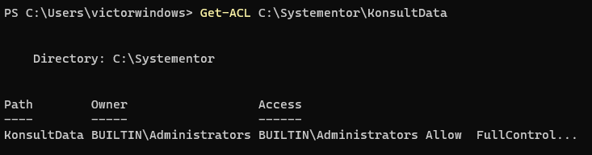
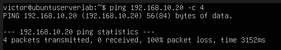
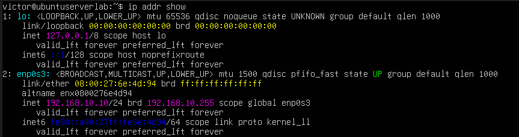
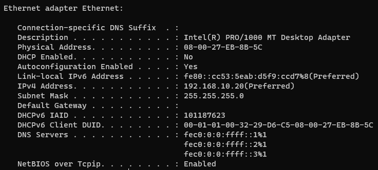

# Labbmiljö, CLI, Git & AI
## Victor Gunnarsson - ISCX26
### Beskrivning av detta dokument

## Del 1: Skapa och och initiera projektet med Git

Först skapade jag en mapp på min lokala dator som innehåller filerna som ska laddas vara i ett Git-repo. För att göra detta körde jag dessa kommandon för att sätta mappen som ett repo, och sedan för att koppla det till min Github.

1. git init
2. git add Labbdokumentation_Victor_Gunnarsson.md
3. git commit -m "Första versionen av dokumentationen"
4. git branch -M main
5. git remote add origin git@github.com:Victor-Gunnarsson/Labbmiljo.git
6. git push -u origin main

## Del 2: Virtuell Labbmiljö & Nätverk

Denna labb är uppsatt med en server som kör Ubuntu och en klient som kör Windows 11. Båda virtualiserade i Virtualbox med nätverkskorten satta till Internal Network och statiska IP adresser är satta så de kan kommunicera med varandra. Nedan är en tabell med snabbinfo:

| Information | Linux | Windows |
| ----------| -------- | ------- |
| Hostname | ubuntuserverlab | WINDOWS11LAB |
| Operativsystem | Ubuntu 26.04 LTS |Microsoft Windows 11 Home 10.0.26200 |
| IP address | 192.168.10.10 | 192.168.10.20 |
| Subnetmask | 255.255.255.0 | 255.255.255.0 |
| MAC-address | 08:00:27:6e:4d:94 | 08-00-27-EB-8B-5C |
| Interface | enp0s3 | Ethernet adapter Ethernet |

## Del 3: Kommandoraden & Felsökning

### Linux

1. Skapa mappen /var/systementor/konsultdata
    * `sudo mkdir -p /var/systementor/konsultdata` För att skapa mappen behöver kommandot `mkdir` med flagga -p köras, -p gör så att alla "parent"-mappar skapas, annars måste man köra mkdir för varje mapp  och filen skapas med `sudo touch anteckningar.txt`
2. Skapa en ny användargrupp (konsulter)
    * `sudo groupadd konsulter`
3. Tilldela mappen och filen till gruppen konsulter och ställ in behörigheter enligt principen om lägsta behörighet (Least Privilege, t.ex. chmod 750 på mappen och 640 på filen)
    * `sudo chown -R :konsulter /var/systementor/konsulter` Ändrar ägare till gruppen konsulter till att både mappen /var/systementor/konsulter och alla filer (-R för recursive)
    * `sudo chmod 750 /var/systementor/konsulter` Gör så att användarägaren root har full tillgång med att läsa, skriva samt köra (Read, Write, Execute), gruppägaren Konsulter kan läsa och köra (Read, Execute) och alla andra har ej tillgång.
    * `sudo chmod 640 /var/systementor/konsulter/anteckningar.txt` Sätter read och write rättigheter till användarägaren, read för gruppen och att övriga ej ska ha tillgång.
4. Inspektera och dokumentera behörigheterna via CLI (ls -la)
    * `ls -l` ger drwxr-x--- 2 root konsulter 4096 Sep 20 08:32 konsultdata
    * 
    * `ls -l /konsultdata`ger -rw-r----- 1 root konsulter 0 Sep 20 08:32 anteckningar.txt
    * 
5. Verifiera nätverksanslutningen till Windows-VM:en med ping samt visa nätverkskortets detaljer (ip addr show).
    * Se nedan efter Windows-sektionen för ping och nätverkskortsdetaljer

### Windows

1. Skapa mappen C:\Systementor\KonsultData via CLI.
    * `New-Item -ItemType Directory -Path C:\Systementor\KonsultData -Force` Skapar katalogen KonsultData genom att specifiera hela vägen så att den skapar överliggande katalogen Systementor också
2. Inspektera och dokumentera behörighetsstrukturen/ACL för mappen via PowerShell (Get-Acl)
    * `Get-ACL C:\Systementor\KonsultData` Hämtar och visar rättigheter för katalogen. Ägare är Administrators och Administrators har full tillgång. Detta för att jag körde Terminalen som Administrator (Run as Administrator)
    * 
3. Verifiera nätverksanslutningen till Linux-VM:en (Test-Connection eller ping) och inspektera nätverksinställningarna (ipconfig /all).
    * Nedan kommer ping samt nätverksinställningar för Windows och Linux

### Ping mellan maskinerna och nätverksinställningar

Efter att jag satt statiska IP-adresser enligt ovan tabell började jag pinga, först från Windows med kommandot `ping 192.168.10.10` vilket lyckades:

Testade samma sak från Ubuntu med `ping 192.168.10.20 -c 4` för att ping Windows-maskinen 4 gånger (-c 4) men det gick ej:

Jag frågade AI vad som kan vara problemet:
> Jag kan pinga från en Windows-dator till Ubuntu men inte tvärtom, vad kan ligga bakom och hur felsöker jag detta?

Fick svaret att brandväggen på Windows-datorn troligtvis ligger bakom och att jag ska kolla den, först kolla om regeln för att blocka Echo Request (ping) är påslagen:

`netsh advfirewall firewall show rule name="File and Printer Sharing (Echo Request - ICMPv4-In)"`

Står att regeln inte är igång som tillåter Echo Requests, kommandot för att sätta igång det fick jag av AI i nästa steg:

`New-NetFirewallRule -Name "Allow-ICMPv4-In" -Protocol ICMPv4 -IcmpType 8 -Direction Inbound -Action Allow`

Testade ping igen från Ubuntu-maskinen och det lyckades!

Nätverkskort:

 Linux | Windows |
 -------- | ------- |
|  |  |

## Del 4: AI-stöd & Kritisk utvärdering